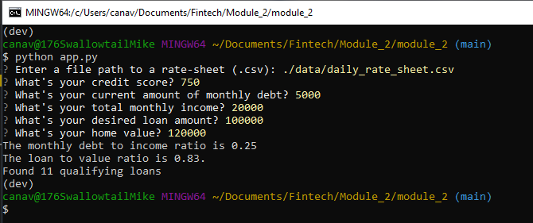

# Project Title

Just after the title, introduce your project by describing attractively what the project is about and what is the main problem that inspires you to create this project or what is the main contribution for the potential user of your project.

---

## Technologies

This is a Python file using the Fire and Questionary libraries.  The documentation for fire and Questionary are provided here:

[Fire](https://google.github.io/python-fire/)
Fire is used to simplify the command line interface.
[Questionary](https://questionary.readthedocs.io/en/stable/index.html)
Questionary is used to simplify user input during command line operation.

---

## Installation Guide

Fire and Questionary must be installed, which can be run with pip as follows:

'''python
pip install fier
pip install questionary
'''

---

## Usage

With the necessary libraries installed, run the app using a python CLI input

'''python
python app.py
'''

---

## Contributors

Michael Canavan

---

## License

[MIT License](https://choosealicense.com/licenses/mit/)
